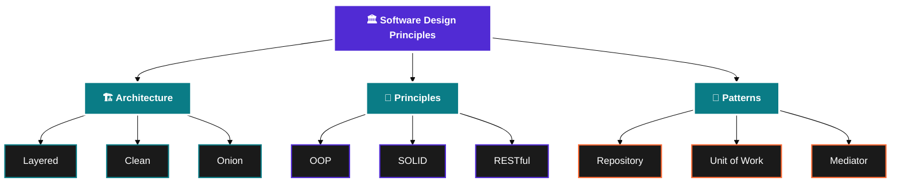

<!-- Banner -->

  

  

 

<table>
<tr>
<td width="50%" align="center" valign="middle">
  <picture>
    <source media="(prefers-color-scheme: dark)" srcset="https://img.shields.io/badge/🎯-MISSION-0A7C86?style=for-the-badge&labelColor=1a1a1a&logo=target&logoColor=white">
    
  </picture>

  

<blockquote>
  
<b>Adapting quickly to new technologies, thriving in teamwork, and continuously improving—innovative and solution-oriented</b>

</blockquote>

</td>
<td width="50%" align="center" valign="middle">
  <picture>
    <source media="(prefers-color-scheme: dark)" srcset="https://img.shields.io/badge/🚀-VISION-512BD4?style=for-the-badge&labelColor=1a1a1a&logo=rocket&logoColor=white">
    
  </picture>

  

<blockquote>
  
<b>Keep learning and building, pushing further in the world of software development</b>

</blockquote>

</td>
</tr>
</table>

 

  

 

##  Technologies & Tools

 

<h3>⚙️ Programming Languages</h3>

 

<table>
<tr>
<td align="center" width="120">

  <b>C#</b>
</td>
<td align="center" width="120">

  <b>Java</b>
</td>
<td align="center" width="120">

  <b>JavaScript</b>
</td>
<td align="center" width="120">

  <b>TypeScript</b>
</td>
<td align="center" width="120">

  <b>Python</b>
</td>
</tr>
</table>

 

<h3>🌐 Frontend Technologies</h3>

 

<table>
<tr>
<td align="center" width="120">

  <b>HTML5</b>
</td>
<td align="center" width="120">

  <b>CSS3</b>
</td>
<td align="center" width="120">

  <b>Bootstrap</b>
</td>
<td align="center" width="120">

  <b>jQuery</b>
</td>
</tr>
</table>

 

  
  
  

 

<h3>🔧 Backend & Frameworks</h3>

 

<table>
<tr>
<td align="center" width="33%" valign="top">

#### Core Framework
 

  

</td>
<td align="center" width="33%" valign="top">

#### Web Development
 

  

  

</td>
<td align="center" width="33%" valign="top">

#### Data Access
 

  

</td>
</tr>
</table>

 

<h3>🗄️ Database Technologies</h3>

 

<table>
<tr>
<td align="center" width="120">

  <b>MySQL</b>
</td>
<td align="center" width="120">

  <b>PostgreSQL</b>
</td>
<td align="center" width="120">

  <b>SQL Server</b>
</td>
<td align="center" width="120">

  <b>MongoDB</b>
</td>
<td align="center" width="120">

  <b>Redis</b>
</td>
<td align="center" width="120">

  <b>Elasticsearch</b>
</td>
</tr>
</table>

 

<h3>🔧 Tools & DevOps</h3>

 

#### 🛠️ Development Tools

 

<table>
<tr>
<td align="center" width="120">

   <b>Visual Studio</b>
</td>
<td align="center" width="120">

   <b>IntelliJ IDEA</b>
</td>
<td align="center" width="120">

   <b>VS Code</b>
</td>
<td align="center" width="120">

   <b>Spyder</b>
</td>
<td align="center" width="120">

   <b>Postman</b>
</td>
</tr>
</table>

 

#### ☁️ DevOps & Infrastructure

 

<table>
<tr>
<td align="center" width="120">

  <b>Git</b>
</td>
<td align="center" width="120">

  <b>GitHub</b>
</td>
<td align="center" width="120">

  <b>Docker</b>
</td>
<td align="center" width="120">

  <b>Azure</b>
</td>
<td align="center" width="120">

  <b>RabbitMQ</b>
</td>
</tr>
</table>

 

<h3>🏗️ Architecture & Design</h3>

 

 

<table>
<tr>
<td align="center" width="33%" valign="top">

### 🏛️ Architectures

 

  

  

 

</td>
<td align="center" width="33%" valign="top">

### 📐 Principles

 

  

  

 

</td>
<td align="center" width="33%" valign="top">

### 🎨 Patterns

 

  

  

 

</td>
</tr>
</table>

 

<h3>🔐 Authentication & Security</h3>

 

  
  
  

 

<h3>🤖 AI & Machine Learning</h3>

 

  
  

 

<h3>📚 Libraries & Tools</h3>

 

| Category | Libraries |
|:--------:|:---------:|
| **✅ Validation** |  |
| **📝 Logging** |   |
| **⚡ Caching** |   |
| **🔄 Mapping** |   |

 

<h3>📋 Methodologies</h3>

 

  
  
  

 

 

  

 

---

 

## 📬 Let's Connect!

 

<table>
<tr>
<td align="center" width="200">
<a href="mailto:emrekekec1996@icloud.com" title="Email" style="text-decoration:none;">

  
<b>📧 Email Me</b>
 
emrekekec1996@icloud.com
</a>
</td>
<td align="center" width="200">
<a href="https://www.linkedin.com/in/eykekec/" title="LinkedIn" style="text-decoration:none;">

  
<b>💼 LinkedIn</b>
 
Connect with me
</a>
</td>
<td align="center" width="200">
<a href="https://wa.me/905321593216" title="WhatsApp" style="text-decoration:none;">

  
<b>💬 WhatsApp</b>
 
Message me directly
</a>
</td>
</tr>
</table>

 

---

 

### 🌟 Let's collaborate and build something amazing together!

 

 

 

---

 

  

  

 

Made with ❤️ by Emre Kekeç

